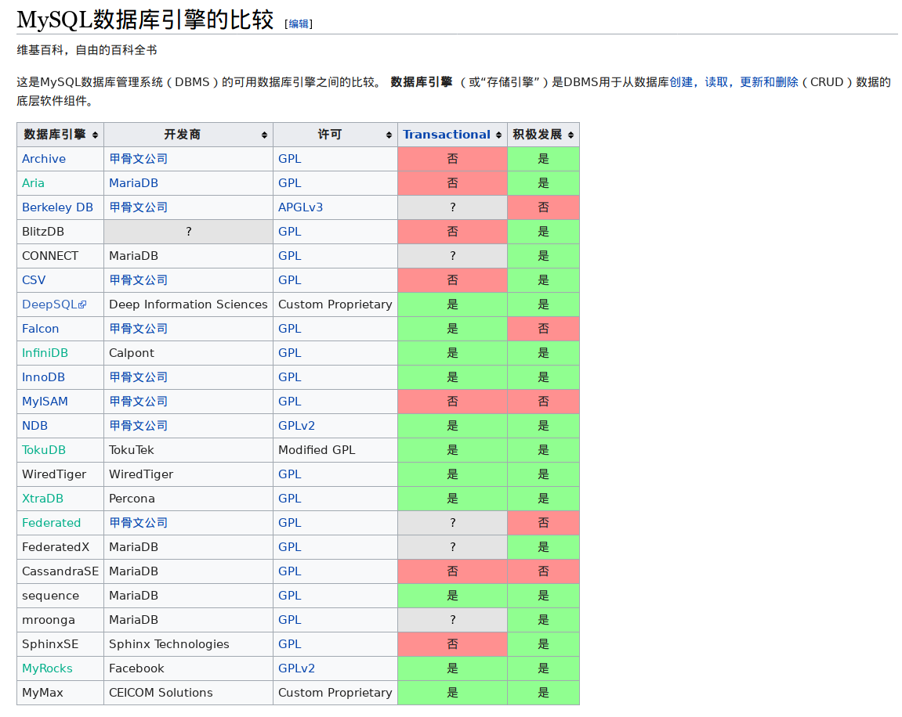

# Python
| 词汇 | 解释 | 参考链接 |
| ------ | ------ | ------ |
| Flask | **Flask**是一个使用[Python](https://zh.wikipedia.org/wiki/Python)编写的轻量级[Web应用框架](https://zh.wikipedia.org/wiki/Web%E5%BA%94%E7%94%A8%E6%A1%86%E6%9E%B6)。基于Werkzeug [WSGI](https://zh.wikipedia.org/wiki/WSGI)工具箱和Jinja2 [模板引擎](https://zh.wikipedia.org/wiki/%E6%A8%A1%E6%9D%BF%E5%BC%95%E6%93%8E)。**Flask**使用BSD授权。Flask被称为“microframework”，因为它使用简单的核心，用extension增加其他功能。Flask没有默认使用的数据库、窗体验证工具。然而，Flask保留了扩增的弹性，可以用[Flask-extension](http://flask.pocoo.org/extensions/)加入这些功能：[ORM](https://zh.wikipedia.org/wiki/%E5%B0%8D%E8%B1%A1%E9%97%9C%E4%BF%82%E6%98%A0%E5%B0%84)、窗体验证工具、文件上传、各种开放式身份验证技术短文本 | [维基百科-Flask](https://zh.wikipedia.org/wiki/Flask) |
# DataBase
| 词汇 | 解释 | 参考链接 |
| ------ | :----- | ------ |
| Redis | **Redis**是一个使用[ANSI C](https://zh.wikipedia.org/wiki/ANSI_C)编写的[开源](https://zh.wikipedia.org/wiki/%E5%BC%80%E6%BA%90)、支持[网络](https://zh.wikipedia.org/wiki/%E7%94%B5%E8%84%91%E7%BD%91%E7%BB%9C)、基于[内存](https://zh.wikipedia.org/wiki/%E5%86%85%E5%AD%98)、可选[持久性](https://zh.wikipedia.org/w/index.php?title=%E6%8C%81%E4%B9%85%E6%80%A7_(%E6%95%B0%E6%8D%AE%E5%BA%93)&action=edit&redlink=1)的[键值对存储数据库](https://zh.wikipedia.org/w/index.php?title=%E9%94%AE%E5%80%BC-%E5%80%BC%E6%95%B0%E6%8D%AE%E5%BA%93&action=edit&redlink=1)。从2015年6月开始，Redis的开发由[Redis Labs](https://zh.wikipedia.org/w/index.php?title=Redis_Labs&action=edit&redlink=1)赞助，而2013年5月至2015年6月期间，其开发由[Pivotal](https://zh.wikipedia.org/wiki/Pivotal)赞助。[[3\]](https://zh.wikipedia.org/wiki/Redis#cite_note-3)在2013年5月之前，其开发由[VMware](https://zh.wikipedia.org/wiki/VMware)赞助。[[4\]](https://zh.wikipedia.org/wiki/Redis#cite_note-4)[[5\]](https://zh.wikipedia.org/wiki/Redis#cite_note-5)根据月度排行网站DB-Engines.com的数据显示，Redis是最流行的键值对存储数据库。 | [维基百科-Redis](https://zh.wikipedia.org/wiki/Redis) |
| MongoDB | **MongoDB**是一种面向文档的[数据库管理系统](https://zh.wikipedia.org/wiki/%E6%95%B0%E6%8D%AE%E5%BA%93%E7%AE%A1%E7%90%86%E7%B3%BB%E7%BB%9F)，由[C++](https://zh.wikipedia.org/wiki/C%2B%2B)撰写而成，以此来解决应用程序开发社区中的大量现实问题。2007年10月，MongoDB由[10gen](https://zh.wikipedia.org/w/index.php?title=10gen&action=edit&redlink=1)团队所发展。2009年2月首度推出。 | [维基百科-MongoDB](https://zh.wikipedia.org/zh-cn/MongoDB) |
| PostgreSQL | [PostgreSQL](https://baike.baidu.com/item/PostgreSQL/530240) 是一个免费的对象-关系数据库服务器(数据库管理系统)，它在灵活的 BSD-风格许可证下发行。它提供了相对其他开放源代码数据库系统(比如 MySQL 和 Firebird)，和专有系统(比如 Oracle、Sybase、IBM 的 DB2 和 Microsoft SQL Server)之外的另一种选择 | [PostgreSQL_百度百科](https://baike.baidu.com/item/PostgreSQL) |
| Cassandra | Apache Cassandra是一套开源分布式NoSQL数据库系统。它最初由Facebook开发，用于储存收件箱等简单格式数据，集Google BigTable的数据模型与Amazon Dynamo的完全分布式架构于一身 | [维基百科-Cassandra](https://zh.wikipedia.org/zh-cn/Cassandra) |
| time series databases | 时序列数据库（Time series database）：用来存储时序列（time-series）数据并以时间（点或区间）建立索引的软件 | [时序*数据库*(TSDB:*time* *series* databases) - 约会远行的专栏](https://www.baidu.com/link?url=EBWJ3kyn1oJH7mzSQL-dTp3ZIHkZu7ielo8s9Qtc0JB5p_n91dJRHMse2D2tPV-IRIakacb4xowW2MtyX4QGrO6JdNeIBCjebDBkIClpu9a&wd=&eqid=a78b8dc1000fa653000000065c9622a0) |
# Data Language

| 词汇                                | 解释                                                         | 参考链接                                                     |
| ----------------------------------- | ------------------------------------------------------------ | ------------------------------------------------------------ |
| **DDL**(Data Definition  Language)  | 数据库定义语言,操作数据库，表(创建，删除，修改)) 主要负责操作数据库和数据表的结构，不操作具体的表数据  具体说，就是只负责数据库和数据表的创建，修改，删除； 比如：定义数据库的名称和编码格式，表的名称和列名以及类型，主外键等等 | [SQL分类：DDL/DML/DQL/DCL以及作用](https://blog.csdn.net/baidu_37107022/article/details/77370354) |
| **DML**(Data Manipulation Language) | 数据库操作语言：操作表的数据(插入，删除，修改)) 主要负责数据表的数据的增删改(insert,delete,update) | [SQL分类：DDL/DML/DQL/DCL以及作用](https://blog.csdn.net/baidu_37107022/article/details/77370354) |
| **DQL**(Data Query Language)        | 数据库查询语言:操作表的数据，查询表的数据) 主要负责数据库的数据查询(select) | [SQL分类：DDL/DML/DQL/DCL以及作用](https://blog.csdn.net/baidu_37107022/article/details/77370354) |
| **DCL**(Data Control Language)      | 数据控制语言 主要是用来设置或更改数据库用户或角色权限的语句 比如Oracle默认的Scott用户没有创建视图的权限 | [SQL分类：DDL/DML/DQL/DCL以及作用](https://blog.csdn.net/baidu_37107022/article/details/77370354) |

# Database Engine(Storage Engine)

# OperatingSystem

| 词汇 | 解释 | 参考链接 |
| :----- | :----- | ------ |
| Kubernetes | **Kubernetes**（常简称为**K8s**）是用于自动部署、扩展和管理[容器化](https://zh.wikipedia.org/wiki/%E4%BD%9C%E6%A5%AD%E7%B3%BB%E7%B5%B1%E5%B1%A4%E8%99%9B%E6%93%AC%E5%8C%96)（containerized）应用程序的[开源](https://zh.wikipedia.org/wiki/%E5%BC%80%E6%BA%90%E8%BD%AF%E4%BB%B6)系统。[[3\]](https://zh.wikipedia.org/wiki/Kubernetes#cite_note-3)该系统由[Google](https://zh.wikipedia.org/wiki/Google)设计并捐赠给Cloud Native Computing Foundation（今属[Linux基金会](https://zh.wikipedia.org/wiki/Linux%E5%9F%BA%E9%87%91%E4%BC%9A)）来使用。它旨在提供“跨主机集群的自动部署、扩展以及运行应用程序容器的平台”。[[4\]](https://zh.wikipedia.org/wiki/Kubernetes#cite_note-4) 它支持一系列容器工具, 包括[Docker](https://zh.wikipedia.org/wiki/Docker_(%E8%BB%9F%E9%AB%94))等。CNCF于2017年宣布首批Kubernetes认证服务提供商（KCSPs），包含[IBM](https://zh.wikipedia.org/wiki/IBM)、[华为](https://zh.wikipedia.org/wiki/%E8%8F%AF%E7%82%BA)、MIRANTIS、inwinSTACK迎栈科技等[[5\]](https://zh.wikipedia.org/wiki/Kubernetes#cite_note-5)服务商 | [维基百科-kubernetes](https://zh.wikipedia.org/wiki/kubernetes) |
| Kubeadm | Kubeadm 是一个工具，它提供了 `kubeadm init` 以及 `kubeadm join` 这两个命令作为快速创建 kubernetes 集群的最佳实践 | [kubeadm 概述- Kubernetes](https://kubernetes.io/zh/docs/reference/setup-tools/kubeadm/kubeadm/) |

# Tool

| 词汇          | 解释                                                         | 参考链接                                                     |
| ------------- | ------------------------------------------------------------ | ------------------------------------------------------------ |
| Flutter       | **Flutter**是一个由[谷歌](https://zh.wikipedia.org/wiki/%E8%B0%B7%E6%AD%8C)开发的[开源](https://zh.wikipedia.org/wiki/%E5%BC%80%E6%BA%90%E8%BD%AF%E4%BB%B6)移动应用软件开发工具包，用于为[Android](https://zh.wikipedia.org/wiki/Android)和[iOS](https://zh.wikipedia.org/wiki/IOS)开发应用，同时也将是[Google Fuchsia](https://zh.wikipedia.org/wiki/Google_Fuchsia)下开发应用的主要工具[[2\]](https://zh.wikipedia.org/wiki/Flutter#cite_note-2) | [维基百科-flutter](https://zh.wikipedia.org/wiki/flutter)    |
| Solr          | Solr是一个独立的[企业级搜索](https://baike.baidu.com/item/%E4%BC%81%E4%B8%9A%E7%BA%A7%E6%90%9C%E7%B4%A2)应用服务器，它对外提供类似于Web-service的API接口。用户可以通过http请求，向搜索引擎服务器提交一定格式的XML文件，生成索引；也可以通过Http Get操作提出查找请求，并得到XML格式的返回结果。 | [*Solr*_百度百科](http://www.baidu.com/link?url=-xejtyGfX00ulfCAPlqHievVATsiXUPi3EpaH-IjGYc886gWJ18h8GTBd-eXoTY7__iNNNxrtUxsyrWrpxylR_&wd=&eqid=afef550d000620b7000000065ca76928) |
| elasticsearch | ElasticSearch是一个基于Lucene的搜索服务器。它提供了一个分布式多用户能力的全文搜索引擎，基于RESTful web接口。Elasticsearch是用Java开发的，并作为Apache许可条款下的开放源码发布，是当前流行的企业级搜索引擎。设计用于[云计算](https://baike.baidu.com/item/%E4%BA%91%E8%AE%A1%E7%AE%97/9969353)中，能够达到实时搜索，稳定，可靠，快速，安装使用方便。 | [*elasticsearch*_百度百科](http://www.baidu.com/link?url=ugV6ioB3hMDOQyp1Yh5GIZu9F9J5X43CjcCWl4vWHD0G7aX0IxgBNNNmUODiryfC6QUbMqWgdwLMSmrXNbheVZzBFLrRIG6NcrrvSfLLQni&wd=&eqid=ff3c6b940001cb5f000000065ca76abb) |

# Distributed 

| 词汇      | 解释                                                         | 参考链接                                                     |
| --------- | ------------------------------------------------------------ | ------------------------------------------------------------ |
| ZooKeeper | Apache ZooKeeper是[Apache软件基金会](https://zh.wikipedia.org/wiki/Apache%E8%BD%AF%E4%BB%B6%E5%9F%BA%E9%87%91%E4%BC%9A)的一个软件项目，他为大型[分布式计算](https://zh.wikipedia.org/wiki/%E5%88%86%E5%B8%83%E5%BC%8F%E8%AE%A1%E7%AE%97)提供[开源](https://zh.wikipedia.org/wiki/%E5%BC%80%E6%BA%90)的分布式配置服务、同步服务和命名注册。[[需要解释](https://zh.wikipedia.org/wiki/Wikipedia:%E4%B8%8D%E8%A6%81%E6%A8%A1%E7%A8%9C%E5%85%A9%E5%8F%AF)] ZooKeeper曾经是[Hadoop](https://zh.wikipedia.org/wiki/Hadoop)的一个子项目，但现在是一个独立的顶级项目。ZooKeeper的架构通过冗余服务实现[高可用性](https://zh.wikipedia.org/w/index.php?title=%E9%AB%98%E5%8F%AF%E7%94%A8%E6%80%A7%E9%9B%86%E7%BE%A4&action=edit&redlink=1)。因此，如果第一次无应答，客户端就可以询问另一台ZooKeeper主机。ZooKeeper节点将它们的数据存储于一个分层的命名空间，非常类似于一个文件系统或一个[前缀树](https://zh.wikipedia.org/wiki/%E5%89%8D%E7%BC%80%E6%A0%91)结构。客户端可以在节点读写，从而以这种方式拥有一个共享的配置服务。更新是[全序](https://zh.wikipedia.org/wiki/%E5%85%A8%E5%BA%8F)的。[[1\]](https://zh.wikipedia.org/wiki/Apache_ZooKeeper#cite_note-1)使用ZooKeeper的公司包括[Rackspace](https://zh.wikipedia.org/wiki/Rackspace)、[雅虎](https://zh.wikipedia.org/wiki/%E9%9B%85%E8%99%8E)[[2\]](https://zh.wikipedia.org/wiki/Apache_ZooKeeper#cite_note-2)和[eBay](https://zh.wikipedia.org/wiki/EBay)，以及类似于像[Solr](https://zh.wikipedia.org/wiki/Solr)这样的开源[企业级搜索](https://zh.wikipedia.org/w/index.php?title=%E4%BC%81%E4%B8%9A%E7%BA%A7%E6%90%9C%E7%B4%A2&action=edit&redlink=1)系统。[[3\]](https://zh.wikipedia.org/wiki/Apache_ZooKeeper#cite_note-3) | [维基百科-ZooKeeper](https://zh.wikipedia.org/wiki/Apache_ZooKeeper) |

# javaWeb

| 词汇 | 解释                                                         | 参考链接                                               |
| ---- | ------------------------------------------------------------ | ------------------------------------------------------ |
| POJO | **POJO**（Plain Ordinary Java Object）简单的Java对象，实际就是普通JavaBeans，是为了避免和EJB混淆所创造的简称。 使用**POJO**名称是为了避免和EJB混淆起来, 而且简称比较直接. | [POJO_百度百科](https://baike.baidu.com/item/POJO)     |
| EJB  | 企业级JavaBean（Enterprise JavaBean, **EJB**）是一个用来构筑企业级应用的服务器端可被管理组件。 Java企业版API（Java Enterprise Edition）中提供了对**EJB**的规范。 **EJB**是一个封装有某个应用程序之业务逻辑服务器端组件。 | [EJB - 维基百科](https://zh.wikipedia.org/zh-hans/EJB) |

# Web

| 词汇   | 解释                                                         | 参考链接                                                     |
| ------ | ------------------------------------------------------------ | ------------------------------------------------------------ |
| AJAX   | **AJAX**即“**Asynchronous JavaScript and XML**”（异步的[JavaScript](https://zh.wikipedia.org/wiki/JavaScript)与[XML](https://zh.wikipedia.org/wiki/XML)技术），指的是一套综合了多项技术的[浏览器](https://zh.wikipedia.org/wiki/%E7%80%8F%E8%A6%BD%E5%99%A8)端[网页](https://zh.wikipedia.org/wiki/%E7%B6%B2%E9%A0%81)开发技术。Ajax的概念由[杰西·詹姆士·贾瑞特](https://zh.wikipedia.org/wiki/%E5%82%91%E8%A5%BF%C2%B7%E8%A9%B9%E5%A7%86%E5%A3%AB%C2%B7%E8%B3%88%E7%91%9E%E7%89%B9)所提出[[1\]](https://zh.wikipedia.org/wiki/AJAX#cite_note-1)。     1. 传统的Web应用允许用户端填写表单（form），当提交表单时就向[网页服务器](https://zh.wikipedia.org/wiki/%E7%B6%B2%E9%A0%81%E4%BC%BA%E6%9C%8D%E5%99%A8)发送一个请求。服务器接收并处理传来的表单，然后送回一个新的网页，但这个做法浪费了许多带宽，因为在前后两个页面中的大部分[HTML](https://zh.wikipedia.org/wiki/HTML)码往往是相同的。由于每次应用的沟通都需要向服务器发送请求，应用的回应时间依赖于服务器的回应时间。这导致了用户界面的回应比本机应用慢得多。                                                                                                                                                      2.与此不同，AJAX应用可以仅向服务器发送并取回必须的数据，并在客户端采用JavaScript处理来自服务器的回应。因为在服务器和浏览器之间交换的数据大量减少，服务器回应更快了。同时，很多的处理工作可以在发出请求的[客户端](https://zh.wikipedia.org/wiki/%E5%AE%A2%E6%88%B7%E7%AB%AF)机器上完成，因此Web服务器的负荷也减少了。      3.类似于[DHTML](https://zh.wikipedia.org/wiki/DHTML)或[LAMP](https://zh.wikipedia.org/wiki/LAMP)，AJAX不是指一种单一的技术，而是有机地利用了一系列相关的技术。虽然其名称包含XML，但实际上数据格式可以由[JSON](https://zh.wikipedia.org/wiki/JSON)代替，进一步减少数据量，形成所谓的AJAJ。而客户端与服务器也并不需要异步。一些基于AJAX的“派生／合成”式（derivative/composite）的技术也正在出现，如[AFLAX](https://zh.wikipedia.org/wiki/AFLAX) | [维基百科-AJAX](https://zh.wikipedia.org/wiki/AJAX)          |
| jQuery | **jQuery**是一套跨[浏览器](https://zh.wikipedia.org/wiki/%E7%80%8F%E8%A6%BD%E5%99%A8)的[JavaScript](https://zh.wikipedia.org/wiki/JavaScript)[库](https://zh.wikipedia.org/wiki/%E5%87%BD%E5%BC%8F%E5%BA%AB)，简化[HTML](https://zh.wikipedia.org/wiki/HTML)与JavaScript之间的操作。[[1\]](https://zh.wikipedia.org/wiki/JQuery#cite_note-jquery.com-1)由[约翰·雷西格](https://zh.wikipedia.org/wiki/%E7%B4%84%E7%BF%B0%C2%B7%E9%9B%B7%E8%A5%BF%E6%A0%BC)（John Resig）在2006年1月的BarCamp NYC上发布第一个版本。当前是由Dave Methvin领导的开发团队进行开发。全球前10,000个访问最高的网站中，有65%使用了jQuery，是当前最受欢迎的JavaScript库[[2\]](https://zh.wikipedia.org/wiki/JQuery#cite_note-2)[[3\]](https://zh.wikipedia.org/wiki/JQuery#cite_note-3) | [维基百科-jQuery](https://zh.wikipedia.org/zh-cn/JQuery)     |
| React  | React 是一个用于构建用户界面的 JAVASCRIPT 库。React主要用于构建UI，很多人认为 React 是 MVC 中的 V（视图）。React 起源于 Facebook 的内部项目，用来架设 Instagram 的网站，并于 2013 年 5 月开源。React 拥有较高的性能，代码逻辑非常简单，越来越多的人已开始关注和使用它。 | [*React* 教程 \| 菜鸟教程](http://www.baidu.com/link?url=HWWaU8Krc0rI7n7pbD2lz-M67Ksd1w8noIhBjOvlNxPws_y2tIY9kJU4Zned3rcxISztdXnGyg_oEj1HKQQtW_&ck=4968.20.0.0.0.241.281.0&shh=www.baidu.com&sht=monline_dg&wd=&eqid=bc4751dc00019bcd000000065ca76bc7) |

# Node.js

| 词汇    | 解释                                                         | 参考链接                                                     |
| ------- | ------------------------------------------------------------ | ------------------------------------------------------------ |
| Express | Express 是一个简洁而灵活的 node.js Web应用框架, 提供了一系列强大特性帮助你创建各种 Web 应用，和丰富的 HTTP 工具。使用 Express 可以快速地搭建一个完整功能的网站。 | [Node.js Express 框架--菜鸟教程](http://www.runoob.com/nodejs/nodejs-express-framework.html) |

# 服务程序

| 词汇   | 解释                                                         | 参考链接                                                     |
| ------ | ------------------------------------------------------------ | ------------------------------------------------------------ |
| 中间件 | 中间件(middleware)是一种独立的[系统](https://baike.baidu.com/item/%E7%B3%BB%E7%BB%9F)软件或服务程序，分布式应用软件借助这种软件在不同的技术之间共享资源。中间件位于客户机/ 服务器的操作系统之上，管理计算机资源和网络通讯。是连接两个独立应用程序或独立系统的[软件](https://baike.baidu.com/item/%E8%BD%AF%E4%BB%B6/12053)。相连接的系统，即使它们具有不同的接口，但通过中间件相互之间仍能交换信息。执行中间件的一个关键途径是信息传递。通过中间件，应用程序可以工作于多平台或[OS](https://baike.baidu.com/item/OS/688)环境。 | [中间件_百度百科](https://baike.baidu.com/item/%E4%B8%AD%E9%97%B4%E4%BB%B6) |

# 大数据引擎

| 词汇   | 解释                                                         | 参考链接                                                     |
| ------ | ------------------------------------------------------------ | ------------------------------------------------------------ |
| Flink  | Flink 是一个针对流数据和批数据的分布式处理引擎。它主要是由 Java 代码实现。目前主要还是依靠开源社区的贡献而发展。对 Flink而言，其所要处理的主要场景就是流数据，批数据只是流数据的一个极限特例而已。再换句话说，Flink 会把所有任务当成流来处理，这也是其最大的特点。 | [新一代大数据处理引擎Apache Flink - IBM](https://www.google.com/url?sa=t&rct=j&q=&esrc=s&source=web&cd=2&cad=rja&uact=8&ved=2ahUKEwjooYXCkrnhAhU_xYsBHRkKCkYQFjABegQIAxAB&url=https%3A%2F%2Fwww.ibm.com%2Fdeveloperworks%2Fcn%2Fopensource%2Fos-cn-apache-flink%2Findex.html&usg=AOvVaw1DJC0x8dKlUbnuHSbB21i0) |
| Spark  | Apache Spark是专为大规模数据处理而设计的快速通用的计算引擎。现在形成一个高速发展应用广泛的生态系统。Spark 是一种与 Hadoop 相似的开源集群计算环境，但是两者之间还存在一些不同之处，这些有用的不同之处使 Spark 在某些工作负载方面表现得更加优越，换句话说，Spark 启用了内存分布数据集，除了能够提供交互式查询外，它还可以优化迭代工作负载。 | [*SPARK*_百度百科](http://www.baidu.com/link?url=IZzJn2_xtEqpHSe3qxP65k8ZmWNRSicbrVzZsN67sr6fgL6FpA0jaSp26-5Y4s_OGHY3d3hyYutzKeF8BwhTgK&wd=&eqid=9be6b75f0002959b000000065ca76800) |
| Hadoop | [Hadoop](https://baike.baidu.com/item/Hadoop)是一个由Apache基金会所开发的[分布式系统](https://baike.baidu.com/item/%E5%88%86%E5%B8%83%E5%BC%8F%E7%B3%BB%E7%BB%9F/4905336)基础架构。用户可以在不了解分布式底层细节的情况下，开发分布式程序。充分利用集群的威力进行高速运算和存储。 Hadoop实现了一个[分布式文件系统](https://baike.baidu.com/item/%E5%88%86%E5%B8%83%E5%BC%8F%E6%96%87%E4%BB%B6%E7%B3%BB%E7%BB%9F/1250388)（Hadoop Distributed File System），简称HDFS。HDFS有高[容错性](https://baike.baidu.com/item/%E5%AE%B9%E9%94%99%E6%80%A7/9131391)的特点，并且设计用来部署在低廉的（low-cost）硬件上；而且它提供高吞吐量（high throughput）来访问[应用程序](https://baike.baidu.com/item/%E5%BA%94%E7%94%A8%E7%A8%8B%E5%BA%8F/5985445)的数据，适合那些有着超大数据集（large data set）的应用程序。 HDFS放宽了（relax）POSIX的要求，可以以流的形式访问（streaming access）文件系统中的数据。 | [*Hadoop*_百度百科](http://www.baidu.com/link?url=EYWH10VjbDPx32X56TUKc_FzIOCKeyVJyhLxhdEImfltr7CmrDOxoecxRJ6-GUzE45uM099GWnwZc5Ms82IKBq&wd=&eqid=fe7bac7200006710000000065ca76881) |

